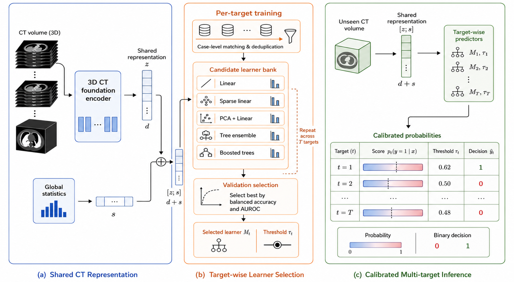
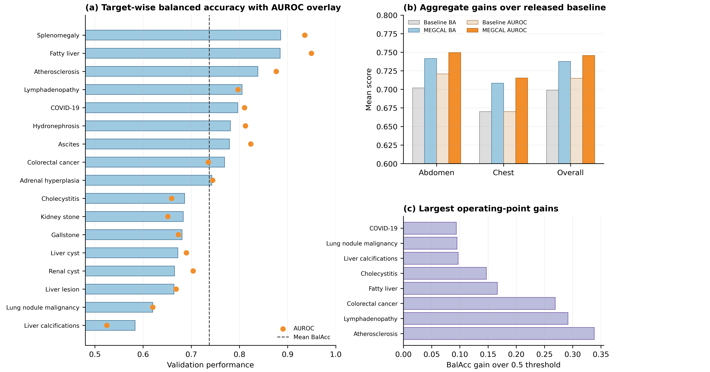

# MEDA: Metric-Conditioned Decision Adaptation for Multi-Target CT Recognition

  

MEDA is a lightweight decision-adaptation framework for multi-target CT recognition. It keeps a shared 3D CT representation fixed and learns target-specific decision rules by selecting both a scoring function and an operating threshold for each diagnostic endpoint.

  <b>17 CT targets</b> •
  <b>0.738 mean balanced accuracy</b> •
  <b>0.746 mean AUROC</b> •
  <b>15/17 targets improved by operating-point calibration</b>

## Results

  

| Region | Targets | Validation N | Positives | BalAcc | AUROC |
|---|---:|---:|---:|---:|---:|
| Abdomen | 15 | 1,634 | 817 | 0.742 | 0.750 |
| Chest | 2 | 264 | 132 | 0.708 | 0.715 |
| Overall | 17 | 1,898 | 949 | **0.738** | **0.746** |

Operating-point calibration improved mean balanced accuracy from **0.635** to **0.738**, with gains in **15/17** targets.
